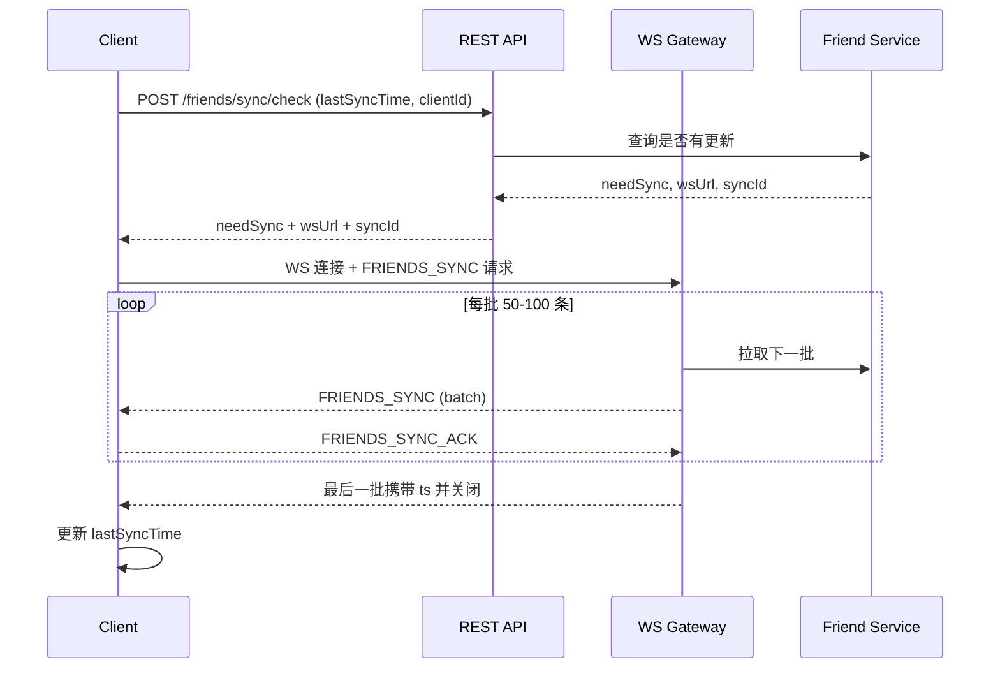
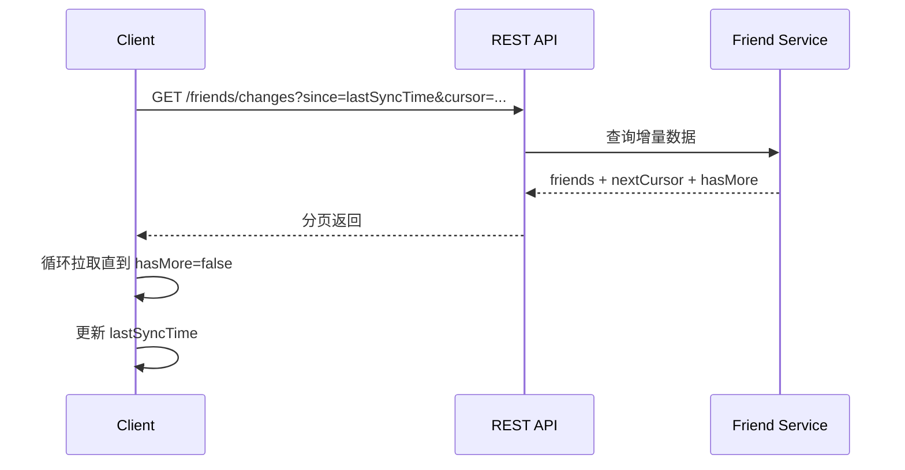
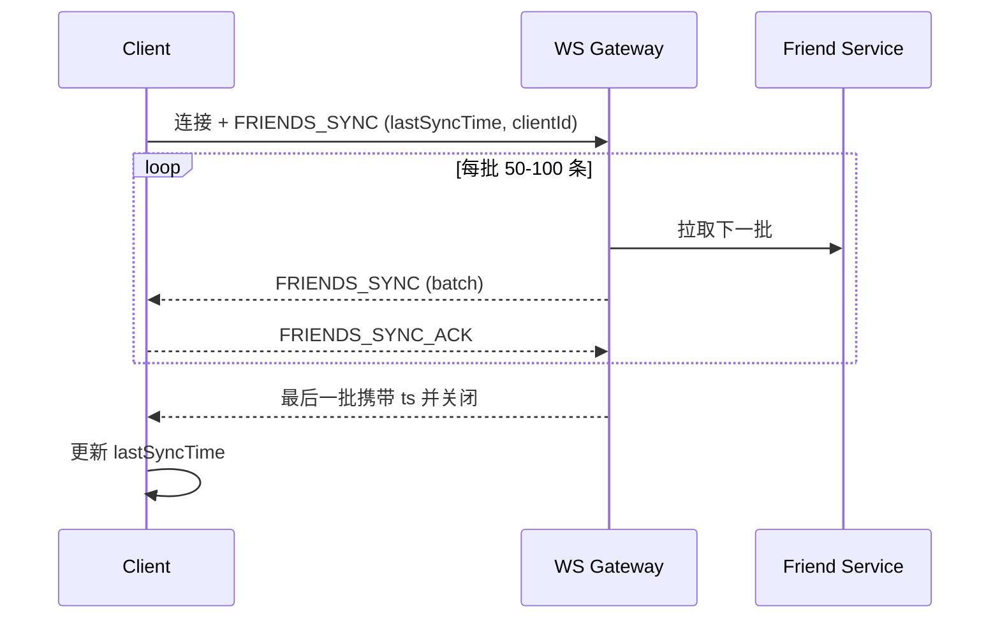
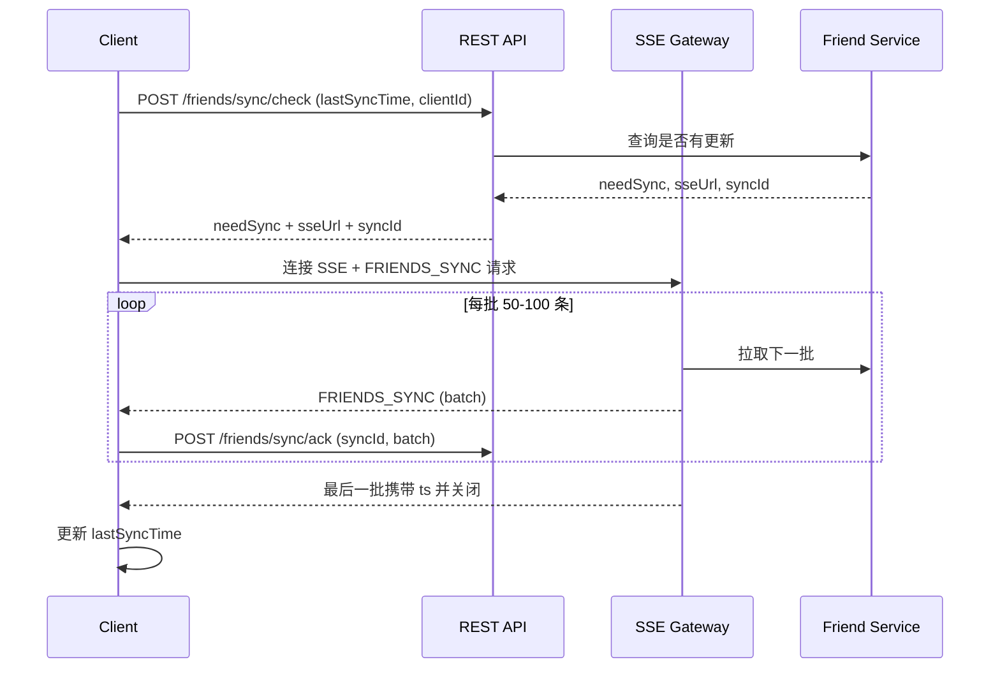
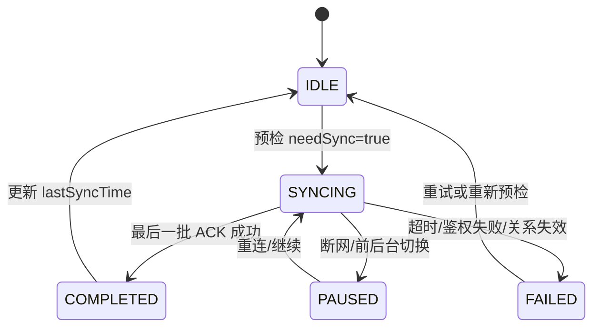

# 好友完整信息同步方案（README）

## 设计目的

### 背景

登录后同步好友完整信息，使用独立 WebSocket 通道分批拉取，完成即关闭，并在好友资料变更时提供订阅式通知。协议只使用 JSON，不引入 PB。
本方案与现有代码对齐：好友拉取在 `src/emcontactmanager.cpp`，好友存储在 `src/emdatabase.cpp`。

### 目标

- 登录后按需同步好友完整信息（头像、昵称、备注等）
- 支持增量同步与断点续传（基于 `lastSyncTime` + ACK）
- 事件通知只投递在线用户（离线依赖下次同步）
- 可复用同一通道做后续会话列表同步

### 非目标

- 不改动现有消息收发通道
- 不引入 PB/自定义二进制协议

### 现状与约束

- `EMContactManager::getContactsFromServer()` 通过 REST `/users/{user}/rosters` 拉取联系人用户名+备注。
- `EMDatabase` 的 `contact` 表仅保存 `username/remark`。
- `EMContact` 模型只有 `username/remark` 字段。

结论：要支持完整好友信息，需要新增服务端同步接口与客户端本地存储扩展。

## 方案

### 数据模型

```
Friend {
  id: string;              // 好友唯一标识
  userId: string;          // 当前用户ID
  friendId: string;        // 好友用户ID
  avatarUrl: string;       // 好友头像URL
  nickname: string;        // 好友昵称
  remark: string;          // 当前用户对好友的备注
  remarkUpdatedAt: timestamp; // 备注更新时间（用于多端一致）
  profileUpdatedAt: timestamp; // 资料更新时间（昵称/头像）
  addedAt: timestamp;      // 好友添加时间
  updatedAt: timestamp;    // 好友关系更新时间
}
```

### 方案一：REST 预检 + WS 分批同步 + 事件推送（推荐）



**优点**
- REST 仅承担预检，响应轻量
- WS 分批可控，支持 ACK 与重试
- 对现有登录/鉴权侵入小

**缺点**
- 需要新建 WS 同步通道与状态管理

### 方案二：纯 REST 增量同步（可选）



**优点**
- 实现简单，无需 WS
- 易于调试

**缺点**
- 大量好友时响应体大、超时风险高
- 不利于未来复用到会话列表

### 方案三：纯 WS 同步（可选）



**优点**
- 链路统一，降低 REST 负载

**缺点**
- 改动面大，缺少预检逻辑
- 调试与运维复杂度更高

### 方案四：REST 预检 + SSE 分批同步（可选）



**优点**
- 单向推送链路清晰，穿透代理/NAT 成功率高
- SSE 天然文本流，易于调试

**缺点**
- 客户端无法通过同一通道回传 ACK，需要额外 REST
- 二进制压缩/多路复用能力弱于 WS
- 未来复用为会话列表同步不如 WS 灵活

### 推荐方案

采用方案一（REST 预检 + WS 分批同步 + 事件推送），与现有登录/鉴权方式最兼容，符合现有交互设计，并为将来会话列表同步预留能力。若网络环境对 WS 不友好，可评估方案四（SSE）。

### 服务端设计（组件）

- Friend Service：查询好友关系与资料
- REST Sync Check：判断是否需要同步 + 下发 WS 地址
- WS Sync Channel：分批推送 + ACK 管控
- Event Dispatcher：好友资料变更事件推送（仅在线用户）

**数据库建议**
- `friend_relation`（或现有好友关系表）：`user_id, friend_id, remark, created_at, updated_at`
- 用户资料（头像/昵称）来自 Profile 服务或缓存表
- `friend_sync_state`（建议持久化）：`user_id, client_id, sync_id, last_ack_batch, updated_at, ttl`

## 对用户API的改变

**主要变更位置**
- `emclient-ios/newSDK/HyphenateSDK/ContactManager/IEMContactManager.h`
- `emclient-ios/newSDK/HyphenateSDK/ContactManager/EMContact.h`

### IEMContactManager 新增接口（建议，Swift 伪代码）

> 现有接口保持兼容；新增同步入口以触发“预检 + 分批同步”，用于登录后自动同步或业务手动触发。

```swift
// 触发一次同步（内部执行 REST 预检 + WS 分批同步）
func syncContactsIfNeeded(completion: ((EMError?) -> Void)?)

// 强制全量同步（不使用 lastSyncTime）
func syncContacts(forceFull: Bool, completion: ((EMError?) -> Void)?)
```

### EMContact 新增属性（建议，Swift 伪代码）

```swift
var avatarUrl: String?
var nickname: String?
var remarkUpdatedAt: Int64
var profileUpdatedAt: Int64
var addedAt: Int64
var updatedAt: Int64
var remarkLocalDirty: Bool // 可选
```

### 平台层监听接口（Swift 伪代码）

> 在 `emclient-ios/newSDK/HyphenateSDK/ContactManager` 增加好友信息变更监听的添加/移除方法，并新增回调。

```swift
protocol EMContactManagerDelegate: AnyObject {
    // 好友信息变更回调
    func contactInfoDidUpdate(_ contact: EMContact)
}

extension EMContactManager {
    // 添加好友信息变更监听
    func addContactInfoChangeListener(_ delegate: EMContactManagerDelegate,
                                      queue: DispatchQueue? = nil)

    // 移除好友信息变更监听
    func removeContactInfoChangeListener(_ delegate: EMContactManagerDelegate)
}
```

### 客户端触发时机与本地存储（SDK 侧建议）

**触发时机**
- 登录成功后，若 `EMOptions#syncContactWithLogin` 为真，调用同步入口

**本地存储**
- 复用 `contact` 表存放好友完整信息（兼容现有逻辑）
- `profile` 表存放同步时间戳（`contacts_last_sync_ts` 等）

**好友信息更新触发点（主动/被动）**
- 主动：`acceptInvitation()` / `setContactRemark()` / `getContactsFromServer()` / 同步入口
- 被动：好友新增/删除事件、多端事件、`FRIEND_UPDATE` 事件

### C++ 伪代码示例（好友信息变更监听）

```cpp
class FriendProfileUpdateEventListener : public EMContactManagerDelegate {
public:
  void onFriendProfileUpdate(const FriendUpdate& evt) {
    if (evt.operation == "delete") {
      db.deleteContact(evt.friendId);
      return;
    }
    auto local = db.getContact(evt.friendId);
    if (local && local.updatedAt > evt.timestamp) {
      return;
    }
    if (evt.changes.hasRemark && local && local.remarkLocalDirty) {
      return;
    }
    db.upsertContact(evt.friendId, evt.changes, evt.timestamp);
  }
};
```

## 与服务器的交互

### REST 预检接口（新增）

`POST /friends/sync/check`

请求：
```
{
  "lastSyncTime": 1234567890,
  "clientId": "xxx-xxx-xxx",
  "protocolVersion": "1.0"
}
```

响应：
```
{
  "needSync": true,
  "syncMode": "full|delta",
  "forceFullSync": false,
  "wsUrl": "wss://sync.example.com/friends",
  "syncId": "sync-123456",
  "dataVersion": "v20240101-001",
  "estimatedTotal": 1000,
  "expiresIn": 60,
  "protocolVersion": "1.0"
}
```

### WS 协议（JSON）

客户端发起：
```
{
  "req": "FRIENDS_SYNC",
  "payload": {
    "lastSyncTime": 1234567890,
    "clientId": "xxx-xxx-xxx",
    "syncId": "sync-123456",
    "dataVersion": "v20240101-001"
  },
  "token": "rest-token",
  "protocolVersion": "1.0"
}
```

服务端分批响应：
```
{
  "type": "FRIENDS_SYNC",
  "payload": {
    "friends": [/* 50-100 条 */],
    "tombstones": [/* 删除/拉黑记录 */],
    "total": 1000,
    "currentBatch": 1,
    "totalBatches": 20,
    "isLastBatch": false,
    "syncId": "sync-123456"
  },
  "ts": "xxxx"
}
```

客户端 ACK：
```
{
  "type": "FRIENDS_SYNC_ACK",
  "payload": {
    "batch": 1,
    "syncId": "sync-123456"
  }
}
```

或批量 ACK：
```
{
  "type": "FRIENDS_SYNC_ACK",
  "payload": {
    "lastReceivedBatch": 5,
    "syncId": "sync-123456"
  }
}
```

### 事件推送

```
{
  "type": "FRIEND_UPDATE",
  "payload": {
    "friendId": "user-123",
    "changes": {
      "nickname": "新昵称",
      "avatarUrl": "新头像URL"
    },
    "timestamp": 1234567891,
    "operation": "update"
  }
}
```

```
{
  "type": "SELF_PROFILE_UPDATE",
  "payload": {
    "changes": {
      "nickname": "新昵称",
      "avatarUrl": "新头像URL"
    },
    "timestamp": 1234567891
  }
}
```

### 同步状态机



### 错误响应格式与错误码

```
{
  "type": "ERROR",
  "payload": {
    "code": "SYNC_EXPIRED | INVALID_TOKEN | RELATION_INVALID | RATE_LIMIT | DATA_VERSION_MISMATCH | SYNC_IN_PROGRESS | STORAGE_FULL | PROTOCOL_VERSION_UNSUPPORTED",
    "message": "...",
    "retryAfter": 60,
    "supportedVersions": ["1.0", "1.1"]
  }
}
```

| 错误码 | 说明 | 客户端处理 |
|--------|------|-----------|
| `SYNC_EXPIRED` | syncId 已过期 | 重新预检 |
| `INVALID_TOKEN` | 鉴权失败 | 刷新 token 后重试 |
| `RELATION_INVALID` | 好友关系失效 | 终止同步并清理 |
| `RATE_LIMIT` | 请求频率超限 | 等待 `retryAfter` |
| `DATA_VERSION_MISMATCH` | 数据版本不一致 | 重新预检 |
| `SYNC_IN_PROGRESS` | 已有同步进行中 | 等待或复用 |
| `STORAGE_FULL` | 存储已满 | 上报并稍后重试 |
| `PROTOCOL_VERSION_UNSUPPORTED` | 协议版本不支持 | 升级/降级 |

### 关键策略

- 基于 `lastSyncTime` 做增量；无更新则返回 `needSync=false`。
- `syncId` 用于幂等与重试；ACK 超时可重发当前批。
- 单用户单客户端只允许一个进行中的同步（避免并发写）。
- 最后一批 `ts` 应为本次同步覆盖数据的最大 `updatedAt/sequence`，不等同于“当前时间”。

### syncId 生命周期

- 由 REST 预检生成并返回，客户端 WS 连接时携带
- TTL 建议 5-10 分钟；过期返回 `SYNC_EXPIRED`
- 过期后客户端需重新预检，不允许继续续传

### syncId 无效/出错边界处理

**常见场景**
- `syncId` 过期/被清理：返回 `SYNC_EXPIRED`
- `syncId` 不存在或已被回收：返回 `INVALID_SYNC_ID`
- `syncId` 与 `clientId/userId` 不匹配：返回 `INVALID_SYNC_ID`
- `syncId` 被重复使用（重放/并发）：返回 `SYNC_IN_PROGRESS` 或 `INVALID_SYNC_ID`
- 服务端重启丢失内存态：返回 `INVALID_SYNC_ID`
- ACK 携带未知批次/越界批次：返回 `INVALID_BATCH`
- `dataVersion` 不一致：返回 `DATA_VERSION_MISMATCH`

**客户端处理**
- `SYNC_EXPIRED/INVALID_SYNC_ID/INVALID_BATCH`：终止同步并重新预检
- `SYNC_IN_PROGRESS`：复用已有同步或等待 backoff 后重试
- `DATA_VERSION_MISMATCH`：重新预检获取新版本并走全量/增量
- 连续 3 次以上错误：触发 `forceFullSync` 兜底并上报

### Tombstone 机制（删除/拉黑）

**数据结构（示例）**
```
Tombstone {
  userId: string;
  friendId: string;
  operation: "delete" | "blacklist";
  opTs: timestamp;
  seq: int64;
  reason: string;
}
```

**保留策略**
- 保留周期 ≥ 增量窗口（如 7 天）+ 缓冲（建议 14-30 天）
- 同一 `friendId` 仅保留最近一次 `operation`
- 日志被截断或 tombstone 不完整时，预检返回 `forceFullSync=true`

**下发策略**
- 增量同步：下发 `opTs/seq` 大于 `lastSyncTime/seq` 的 tombstone
- 全量同步：最后一批附带完整 tombstone 列表
- 客户端以 tombstone 优先覆盖同步数据

### 备注字段多端冲突解决

**原则**
- 备注是“当前用户视角”字段，只在同账号多端之间冲突
- 以服务端时间/序列为准，客户端本地时间不参与决策

**写入协议（建议）**
```
POST /friends/remark
{
  "friendId": "...",
  "remark": "...",
  "clientId": "...",
  "baseRemarkUpdatedAt": 1234567890
}
```

**服务端处理**
- `baseRemarkUpdatedAt` 小于当前 `remark_updated_at` 时判冲突
- 可直接覆盖（LWW）或返回 `409 CONFLICT`

**客户端处理**
- 本地修改前记录 `baseRemarkUpdatedAt`
- 写入成功后使用服务端返回时间落库
- `remark_local_dirty` 用于避免静默覆盖

### WS 复用与生命周期

- 同步通道默认短连接：完成后关闭
- 事件推送走已有消息长连接（默认）
- 复用场景：通过 `req` 区分（如 `FRIENDS_SYNC`/`SESSION_SYNC`）
- 空闲超时：60-120s 无业务流量自动关闭
- 同一连接只串行处理一个同步请求

### clientId 生成与持久化

- 首次启动生成 `UUIDv4`，作为“安装级别”标识
- 持久化：本地配置文件 + `profile` 表冗余存储
- 卸载重装生成新值；账号切换不改变 `clientId`

### 心跳与同步优先级

- 数据帧优先级：`SYNC_DATA/ACK` > `EVENT` > `PING/PONG`
- 同步进行中：减少心跳频率，避免抢占带宽
- 空闲阶段：保持低频心跳（30-60s）

### forceFullSync 触发条件

- `DATA_VERSION_MISMATCH` 或服务端快照轮转
- 增量日志/Tombstone 已被截断或过期
- `lastSyncTime/seq` 异常（回退/未来时间）
- 客户端本地库损坏或迁移失败（客户端主动声明）
- 连续 N 次增量同步失败（如 3 次）
- 协议版本升级导致字段不兼容

## 安全相关

- 使用现有鉴权体系：REST 预检返回 `wsUrl` 与 `syncId`，WS 建连携带 `token`。
- `syncId` 与 `clientId/userId` 绑定校验，防重放/串用。
- `dataVersion` 校验快照一致性，不一致返回 `DATA_VERSION_MISMATCH`。
- 频控：REST/WS 统一限流，错误码 `RATE_LIMIT` 并返回 `retryAfter`。
- WS 心跳使用 PING/PONG 或应用层 `PING`/`PONG`。

## 兼容性

### 协议与灰度

- `protocolVersion` 用于协议版本协商，支持服务端双栈。
- 新字段只追加，不影响旧客户端反序列化。
- 灰度回滚时：旧客户端忽略 tombstone 字段；新客户端可降级到 REST 增量或全量。

### DB 迁移（v18 → v19）

**现有结构（当前版本）**
- `profile`：`username, token, token_savedtime, rosterversion, publickey, encrypt_type, syncSilentModelLastTime`
- `contact`：`username, remark`
- `CURRENT_DB_VERSION = 18`

**目标结构**
- `contact` 扩展字段：`avatar_url, nickname, remark_updated_at, profile_updated_at, added_at, updated_at`（可选 `remark_local_dirty`）
- `profile` 扩展字段：`contacts_last_sync_ts, contacts_last_sync_seq`

**升级步骤（事务内执行）**
1. `CURRENT_DB_VERSION` 升级到 19
2. 新增 `performMigrationFromVersion18()` 与 `checkMigrationFromVersion18()`
3. 在 `createTableIfNotExist` 中更新 `profile/contact` 建表语句
4. 迁移 SQL：
   - `ALTER TABLE contact ADD COLUMN avatar_url TEXT DEFAULT ''`
   - `ALTER TABLE contact ADD COLUMN nickname TEXT DEFAULT ''`
   - `ALTER TABLE contact ADD COLUMN remark_updated_at INT8 DEFAULT 0`
   - `ALTER TABLE contact ADD COLUMN profile_updated_at INT8 DEFAULT 0`
   - `ALTER TABLE contact ADD COLUMN added_at INT8 DEFAULT 0`
   - `ALTER TABLE contact ADD COLUMN updated_at INT8 DEFAULT 0`
   - `ALTER TABLE profile ADD COLUMN contacts_last_sync_ts INT8 DEFAULT 0`
   - `ALTER TABLE profile ADD COLUMN contacts_last_sync_seq INT8 DEFAULT 0`
   - （可选）`ALTER TABLE contact ADD COLUMN remark_local_dirty INT1 DEFAULT 0`
5. 迁移成功后 `setDBVersion(19)`；失败 `ROLLBACK` 并保持旧版本

**关键代码调整（避免 REPLACE 覆盖新字段）**
- `saveToken()` 当前为 `INSERT OR REPLACE`，需改为 `UPDATE + INSERT`
- `saveContact()`/`saveContacts()` 改为全字段 upsert

## 性能和边界条件

- 分批大小 50-100 条，必要时设置单批字节上限（64KB/128KB）。
- ACK 形成自然背压；默认 Stop-and-Wait，性能要求高时启用窗口（3-5）。
- 单次同步超时建议 5-10 分钟，超时进入 `FAILED`。
- 乱序批次：缓存窗口 `maxOutOfOrderBatches=3`，等待超时 30 秒触发重发。
- Tombstone 保留周期 ≥ 增量窗口 + 缓冲（建议 14-30 天）。
- 大量好友（上限 3000）：必须分批、可选 WS 压缩（`permessage-deflate`）。
- 多进程 SQLite：单写多读、WAL、`busy_timeout`、事务写入。
- 网络切换：断线进入 `PAUSED`，优先续传；`syncId` 过期重新预检。
- 删除/拉黑优先级最高，覆盖后续同步数据。
- 仅最后一批更新 `lastSyncTime`，以服务端 `ts` 为准。

**监控建议**
- WS 连接失败率、同步失败率、ACK 超时率
- 平均同步耗时、首包时间、批次间隔 P95
- forceFullSync 触发率异常上升

## 问题排查

- `SYNC_EXPIRED/INVALID_SYNC_ID`：检查 `syncId` 是否过期或被复用；重新预检。
- `DATA_VERSION_MISMATCH`：服务端快照轮转；重新预检并走全量。
- 同步经常失败：检查 WS 连接/心跳超时、ACK 是否及时返回。
- 头像/昵称不更新：检查是否收到 `FRIEND_UPDATE` 事件，或是否走了增量同步。
- 本地数据被回退：确认以 `updatedAt/timestamp` 去重；删除/拉黑应优先。
- DB 迁移失败：检查 `user_version`、SQL 执行顺序与事务回滚逻辑。
