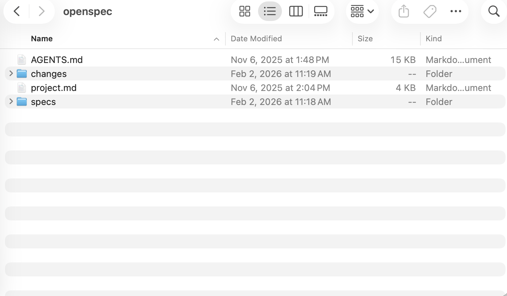
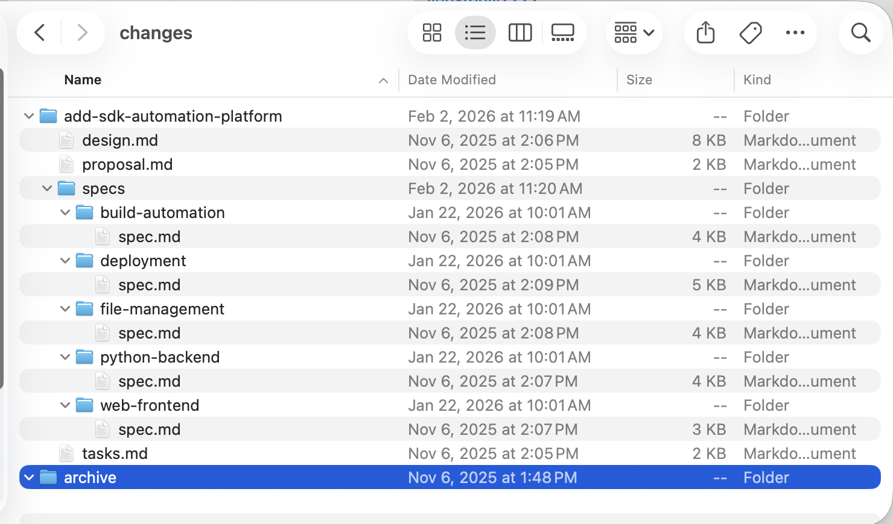
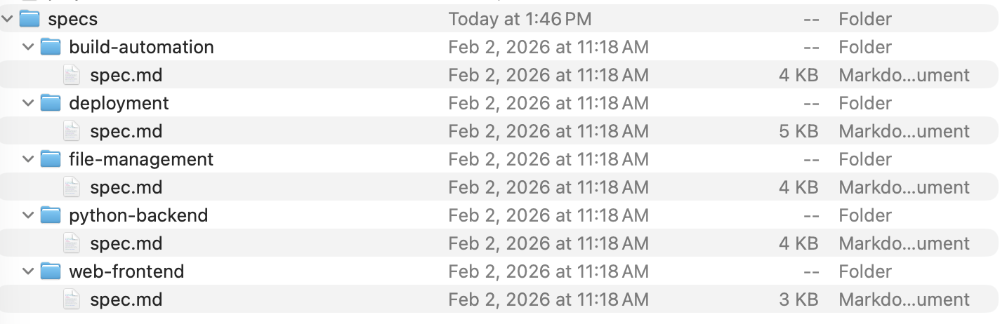

# OpenSpec 迭代演进实战指南

> 基于 PackageIMSDK 项目的真实案例，讲解如何使用 OpenSpec 进行规范驱动开发

---

# 第一部分：理念篇

## 什么是 OpenSpec？

**OpenSpec** 是一套规范驱动开发（Spec-Driven Development）的方法论和工具。

### 一句话概括

```
先写规范，再写代码。规范即文档，规范即测试用例。
```

### 核心哲学

```
→ fluid not rigid        流动而非僵化（不卡阶段，随时按需推进）
→ iterative not waterfall 迭代而非瀑布（边构建边学习，边推进边优化）
→ easy not complex       简单而非复杂（轻量启动，最少仪式感）
→ brownfield-first       存量优先（为现有代码库设计，不只是新项目）
```

### 核心思想

```
┌─────────────────────────────────────────────────────────────┐
│                    OpenSpec 核心思想                         │
├─────────────────────────────────────────────────────────────┤
│                                                             │
│   specs/  ═══════════════════  当前真实状态（已构建的）        │
│                                                             │
│   changes/ ══════════════════  变更提案（计划要做的）          │
│                                                             │
│   归档后 specs/ 自动更新 ════  保持文档与代码同步              │
│                                                             │
└─────────────────────────────────────────────────────────────┘
```

### 传统开发 vs OpenSpec 开发

| 维度 | 传统开发 | OpenSpec 开发 |
|------|---------|--------------|
| **需求管理** | 需求在脑子里/聊天记录里 | 需求在 `specs/` 目录，结构化存储 |
| **变更流程** | 想到就改，随意提交 | 先写 `proposal.md`，审批后再改 |
| **文档维护** | 文档和代码经常脱节 | 规范即文档，归档时自动同步 |
| **AI 协作** | AI 不知道项目背景 | AI 读取 `project.md` 理解上下文 |
| **历史追溯** | 靠 git log 和记忆 | 变更历史在 `changes/archive/` |
| **团队协作** | 口头沟通，容易遗漏 | 提案文档化，可追溯可复查 |

### 为什么需要 OpenSpec？

```
问题场景：

❌ "这个功能当初为什么这么设计的？" → 没人记得
❌ "文档和代码对不上" → 文档过时了
❌ "AI 帮我改这个功能" → AI 不知道项目规范
❌ "这次改动会影响什么？" → 只能靠经验猜

OpenSpec 解决方案：

✅ 每个变更都有 proposal.md 记录原因
✅ 归档时自动合并规范到 specs/
✅ AI 读取 AGENTS.md + project.md 理解项目
✅ proposal.md 明确列出影响范围
```

### OpenSpec 的三个核心文件

| 文件 | 作用 | 谁读 |
|------|------|------|
| `project.md` | 项目背景、技术栈、约束 | AI + 开发者 |
| `AGENTS.md` | AI 助手的工作指令 | AI |
| `specs/*/spec.md` | 具体功能的需求规范 | AI + 开发者 |

---

# 第二部分：流程篇

## 目录结构

```
openspec/
├── AGENTS.md              # AI 助手指令
├── project.md             # 项目上下文
├── specs/                 # 📦 当前真实状态（已构建）
│   └── [capability]/
│       ├── spec.md        # 需求和场景
│       └── design.md      # 技术设计（可选）
└── changes/               # 📝 变更提案（计划构建）
    ├── [change-name]/
    │   ├── proposal.md    # 为什么改、改什么
    │   ├── tasks.md       # 实现任务清单
    │   ├── design.md      # 技术决策（可选）
    │   └── specs/         # 增量规范
    │       └── [capability]/
    │           └── spec.md
    └── archive/           # 已完成的变更
```



## OPSX 工作流：Actions, Not Phases

> 传统工作流把你锁在"阶段"中——先规划、再实现、然后结束。OPSX 采用 **流动动作（fluid actions）** 模式：命令是你**可以做的事**，而不是你**被困住的阶段**。

```
传统（阶段锁定）：

  PLANNING ────────► IMPLEMENTING ────────► DONE
      │                    │
      │   "不能回头"        │
      └────────────────────┘

OPSX（流动动作）：

  /opsx:new ──► /opsx:ff ──► /opsx:apply ──► /opsx:verify ──► /opsx:archive
                  │                              │
               或逐步：                       可选但推荐
            /opsx:continue
```

### Artifact 依赖图

Artifact（制品）之间形成依赖关系，**依赖是启用条件，不是必须的下一步**：

```
                    proposal
                   （根节点）
                       │
         ┌─────────────┴─────────────┐
         │                           │
         ▼                           ▼
      specs                       design
   （需要：proposal）          （需要：proposal）
         │                           │
         └─────────────┬─────────────┘
                       │
                       ▼
                    tasks
              （需要：specs + design）
```

> 你可以跳过 design（如果不需要），也可以先创建 specs 或 design——两者都只依赖 proposal。



---

## 三种工作流模式

### 模式一：Quick Feature（快速功能）

**适用场景**：你清楚要做什么，直接执行。

```text
You: /opsx:new add-logout-button

AI:  Created openspec/changes/add-logout-button/
     Ready to create: proposal

You: /opsx:ff

AI:  Creating all planning artifacts...
     ✓ proposal.md
     ✓ specs/
     ✓ design.md
     ✓ tasks.md
     Ready for implementation!

You: /opsx:apply

AI:  Working through tasks...
     ✓ Added logout button to header
     ✓ Implemented session clearing
     ✓ Added confirmation dialog
     All tasks complete!

You: /opsx:verify

AI:  COMPLETENESS ✓ | CORRECTNESS ✓ | COHERENCE ✓
     Ready to archive!

You: /opsx:archive

AI:  ✓ Merged specs
     ✓ Archived change
```

### 模式二：Exploratory（探索式）

**适用场景**：需求不明确，需要先调研。

```text
You: /opsx:explore

AI:  What would you like to explore?

You: 我想优化页面加载性能，但不确定瓶颈在哪

AI:  Let me investigate...
     [分析打包体积、查找慢查询、检查组件渲染]

     找到三个主要瓶颈：
     1. 大型未优化图片
     2. ProductList 中的同步数据获取
     3. Context 变化导致的重渲染

     你想先解决哪个？

You: 先处理数据获取问题

You: /opsx:new optimize-product-list-fetching

AI:  Created change. Ready to create: proposal

You: /opsx:continue    # 逐步创建，每步可审查

AI:  Creating proposal based on our exploration...
```

### 模式三：Parallel Changes（并行变更）

**适用场景**：同时处理多个变更，可中途切换。

```text
You: 我正在做 add-dark-mode，但需要先修一个紧急 bug

You: /opsx:new fix-login-redirect
AI:  Created openspec/changes/fix-login-redirect/

You: /opsx:ff
You: /opsx:apply
You: /opsx:archive
AI:  ✓ Archived fix-login-redirect

You: 回到暗色模式

You: /opsx:apply add-dark-mode
AI:  Resuming add-dark-mode...
     Picking up at task 2.3: Update Header...
```

> 💡 多个完成的变更可以用 `/opsx:bulk-archive` 一次性批量归档，OpenSpec 会自动检测并解决 spec 冲突。

---

## `/opsx:ff` vs `/opsx:continue` 选择指南

| 场景 | 推荐 |
|------|------|
| 需求明确，准备开始 | `/opsx:ff`（一次生成所有规划文档） |
| 需求不明确，想逐步审查 | `/opsx:continue`（逐个创建制品） |
| 想在写 specs 之前先完善 proposal | `/opsx:continue` |
| 时间紧迫，需要快速推进 | `/opsx:ff` |
| 复杂变更，需要精细控制 | `/opsx:continue` |

**经验法则**：如果你能一次描述清楚整个范围，用 `/opsx:ff`；如果你还在摸索，用 `/opsx:continue`。

---

## 何时更新现有变更 vs 创建新变更

```
                     ┌─────────────────────────────────────┐
                     │     这还是同一项工作吗？              │
                     └──────────────┬──────────────────────┘
                                    │
                 ┌──────────────────┼──────────────────┐
                 │                  │                  │
                 ▼                  ▼                  ▼
          意图相同？         > 50% 重叠？       原变更能独立
          问题相同？         范围相同？          "完成"吗？
                 │                  │                  │
       ┌────────┴────────┐  ┌──────┴──────┐   ┌───────┴───────┐
      YES               NO YES           NO  NO              YES
       │                 │  │             │   │               │
       ▼                 ▼  ▼             ▼   ▼               ▼
    更新现有           新建  更新现有      新建  更新现有        新建
```

**举例**：「添加暗色模式」
- "还需要支持自定义主题" → **新建**（范围爆炸了）
- "系统偏好检测比预期复杂" → **更新**（意图不变）
- "先上线开关，偏好设置以后再做" → **更新后归档，再新建**

---

## 创建变更提案

### 什么时候需要创建提案？

```
✅ 需要创建提案：
├── 新增功能或能力
├── 破坏性变更（API、数据结构）
├── 架构或模式变更
├── 性能优化（改变行为）
└── 安全模式更新

❌ 不需要创建提案：
├── Bug 修复（恢复预期行为）
├── 拼写错误、格式、注释
├── 依赖更新（非破坏性）
├── 配置变更
└── 为现有行为补充测试
```

### 使用 OPSX 命令创建（推荐）

```text
# 方式一：快速创建 + 一次性生成所有制品
/opsx:new add-user-management
/opsx:ff

# 方式二：逐步创建，每步可审查
/opsx:new add-user-management
/opsx:continue    # 创建 proposal
# （审查 proposal，满意后继续）
/opsx:continue    # 创建 specs
/opsx:continue    # 创建 design
/opsx:continue    # 创建 tasks
```

### 手动创建（也可以）

```bash
# Step 1: 了解当前状态
openspec list              # 查看进行中的变更
openspec list --specs      # 查看现有能力

# Step 2: 创建变更目录
CHANGE=add-user-management
mkdir -p openspec/changes/$CHANGE/specs/user-auth

# Step 3: 编写核心文件
# - proposal.md（必需）
# - tasks.md（必需）
# - specs/[capability]/spec.md（必需）
# - design.md（可选，复杂变更时需要）

# Step 4: 验证
openspec validate $CHANGE --strict
```

### proposal.md 模板

```markdown
## Why
当前 IM SDK 的打包流程需要手动执行多个步骤，效率低下且容易出错。

## What Changes
- **新增 Web 前端界面**：提供直观的打包请求界面
- **新增 Python 后端服务**：处理打包请求、管理构建任务
- **新增构建自动化流程**：在 macOS 上自动执行构建脚本
- **BREAKING**：废弃旧的手动打包脚本

## Impact
### Affected Specs
- `web-frontend` - 新增 capability
- `python-backend` - 新增 capability
- `build-automation` - 新增 capability

### Affected Code
- 前端代码位于 `/frontend` 目录
- 后端代码位于 `/backend` 目录
```

### tasks.md 模板

```markdown
## 1. 项目初始化
- [ ] 1.1 创建前端项目结构
- [ ] 1.2 创建后端项目结构
- [ ] 1.3 配置代码格式化工具

## 2. 后端服务实现
- [ ] 2.1 实现打包请求接收 API
- [ ] 2.2 实现终端窗口打开功能
- [ ] 2.3 实现构建进程监控

## 3. 前端界面实现
- [ ] 3.1 创建打包请求提交页面
- [ ] 3.2 创建构建状态监控界面
```

### spec.md（增量规范）模板



```markdown
## ADDED Requirements

### Requirement: Terminal Window Launch
系统 SHALL 在 macOS 上以用户身份打开新终端窗口执行构建脚本。

#### Scenario: 启动构建脚本
- **WHEN** 系统接收到构建请求
- **THEN** 使用 AppleScript 打开新的 Terminal.app 窗口
- **AND** 在新窗口中执行命令 "cd ~/Desktop && sh buildChat.sh"
- **AND** 记录终端进程 PID

#### Scenario: 终端启动失败
- **WHEN** 尝试启动终端时发生错误
- **THEN** 记录错误日志
- **AND** 标记构建任务为失败状态
```

---

## 实现变更：`/opsx:apply`

### 使用 OPSX 命令实现（推荐）

```text
You: /opsx:apply

AI:  Implementing add-user-management...

     Reading tasks.md:
     - [ ] 1.1 创建前端项目结构
     - [ ] 1.2 创建后端项目结构
     - [ ] 1.3 配置代码格式化工具

     Working on 1.1: 创建前端项目结构...
     [Creates frontend directory structure]

     ✓ 1.1 Complete

     Working on 1.2: 创建后端项目结构...
     [Creates backend directory structure]

     ✓ 1.2 Complete
     ...
     All tasks complete!
```

> 💡 `/opsx:apply` 支持中断后恢复——如果被打断，再次运行会从上次未完成的任务继续。

### 实现阶段要点

```
⚠️ 未经批准不要开始实现
   提案需要先审核通过

⚠️ 按 tasks.md 中的顺序执行
   任务之间可能有依赖关系

⚠️ 完成一个任务立即标记
   保持进度可见（将 [ ] 改为 [x]）
```

---

## 验证与归档：`/opsx:verify` → `/opsx:archive`

### 验证实现：`/opsx:verify`

归档前建议先验证，检查实现是否与规范一致：

```text
You: /opsx:verify

AI:  Verifying add-user-management...

     COMPLETENESS（完整性）
     ✓ All 8 tasks in tasks.md are checked
     ✓ All requirements in specs have corresponding code
     ⚠ Scenario "用户删除后数据清理" not tested

     CORRECTNESS（正确性）
     ✓ Implementation matches spec intent
     ✓ Edge cases from scenarios are handled
     ✓ Error states match spec definitions

     COHERENCE（一致性）
     ✓ Design decisions reflected in code structure
     ✓ Naming conventions consistent with design.md
     ⚠ Design mentions "事件驱动" but implementation uses polling

     SUMMARY
     ─────────────────────────────
     Critical issues: 0
     Warnings: 2
     Ready to archive: Yes (with warnings)

     Recommendations:
     1. 补充用户删除场景的测试
     2. 重构为事件驱动实现，或更新 design.md
```

| 验证维度 | 检查内容 |
|---------|---------|
| **Completeness** | 所有任务完成、所有需求已实现、场景已覆盖 |
| **Correctness** | 实现符合 spec 意图、边界情况已处理 |
| **Coherence** | 设计决策体现在代码中、模式一致 |

> verify 不会阻止归档，但会暴露你可能想先解决的问题。

### 归档变更：`/opsx:archive`

```text
You: /opsx:archive

AI:  Archiving add-user-management...

     Artifact status:
     ✓ proposal.md exists
     ✓ specs/ exists
     ✓ design.md exists
     ✓ tasks.md exists (8/8 tasks complete)

     Delta specs: Not yet synced to main
     → Would you like to sync now?

You: Yes

AI:  ✓ Synced specs to openspec/specs/user-auth/spec.md
     ✓ Moved to openspec/changes/archive/2025-02-04-add-user-management/

     Change archived successfully.
```

### 也可以用 CLI 命令归档

```bash
# 标准归档（会更新 specs/ 目录）
openspec archive add-user-management --yes

# 纯工具类变更（不影响 specs）
openspec archive add-tooling --skip-specs --yes

# 验证归档后的状态
openspec validate --strict
```

### 归档前后对比

```
归档前：
├── changes/add-user-management/    # 变更提案
│   ├── proposal.md
│   ├── tasks.md
│   └── specs/user-auth/spec.md     # 增量规范
└── specs/                          # 不变

归档后：
├── changes/archive/2025-02-04-add-user-management/  # 已归档
└── specs/user-auth/spec.md         # ✅ 已合并增量规范
```

---

## OPSX 斜杠命令速查

> 在 AI 助手的聊天界面中使用（Claude Code、Cursor、Windsurf 等）。

| 命令 | 作用 | 适用场景 |
|------|------|---------|
| `/opsx:explore` | 探索想法，调研问题 | 需求不明确、需要调研 |
| `/opsx:new` | 创建新变更 | 开始任何新工作 |
| `/opsx:continue` | 创建下一个制品 | 逐步创建，每步可审查 |
| `/opsx:ff` | 快进：一次创建所有规划制品 | 需求明确，快速推进 |
| `/opsx:apply` | 实现任务 | 准备写代码了 |
| `/opsx:verify` | 验证实现与制品匹配 | 归档前检查质量 |
| `/opsx:sync` | 合并增量 specs 到主 specs | 长期变更需要提前同步 |
| `/opsx:archive` | 归档已完成的变更 | 工作全部完成 |
| `/opsx:bulk-archive` | 批量归档多个变更 | 并行工作流，批量完成 |
| `/opsx:onboard` | 交互式新手教程 | 第一次使用 OpenSpec |

#### 不同 AI 工具的命令语法

| 工具 | 语法示例 |
|------|---------|
| Claude Code | `/opsx:new`, `/opsx:apply` |
| Cursor | `/opsx-new`, `/opsx-apply` |
| Windsurf | `/opsx-new`, `/opsx-apply` |
| Copilot (IDE) | `/opsx-new`, `/opsx-apply` |
| Trae | `/openspec-new-change`, `/openspec-apply-change` |

> 功能完全相同，只是语法格式不同。

#### Legacy 命令（旧版）

旧版命令仍可使用，但推荐 OPSX 命令：

| 旧命令 | 作用 |
|--------|------|
| `/openspec:proposal` | 一次性创建所有制品（proposal, specs, design, tasks） |
| `/openspec:apply` | 实现变更 |
| `/openspec:archive` | 归档变更 |

## CLI 终端命令速查

```bash
# 📋 查看状态
openspec list                    # 列出进行中的变更
openspec list --specs            # 列出所有能力
openspec show [item]             # 查看详情

# ✅ 验证
openspec validate [change]       # 基础验证
openspec validate [change] --strict  # 严格验证（推荐）

# 📦 归档
openspec archive <change-id> --yes        # 归档变更
openspec archive <change-id> --skip-specs --yes  # 跳过 specs 更新

# 🔍 调试
openspec show [change] --json --deltas-only  # 查看增量解析结果

# 🔧 管理
openspec init                    # 初始化项目
openspec update                  # 刷新 AI 指令（升级后执行）
openspec schemas                 # 列出可用 schema
openspec schema init <name>      # 创建自定义 schema
```

---

## 与 AI 助手协作

### 安装与初始化

```bash
# 1. 全局安装 OpenSpec（需要 Node.js >= 20.19.0）
npm install -g @fission-ai/openspec@latest

# 2. 进入项目目录，初始化
cd your-project
openspec init          # 交互式选择你使用的 AI 工具

# 非交互式（CI/CD 或脚本化）
openspec init --tools claude          # 只配置 Claude Code
openspec init --tools codex           # 只配置 Codex CLI
openspec init --tools claude,codex    # 同时配置两者
openspec init --tools all             # 配置所有支持的工具（20+）
```

### Claude Code 集成

```bash
openspec init --tools claude
```

**安装的文件**：

```
your-project/
├── .claude/
│   ├── skills/                    # 10 个 skill 文件（驱动 OPSX 命令）
│   │   ├── openspec-explore.md
│   │   ├── openspec-new-change.md
│   │   ├── openspec-continue-change.md
│   │   ├── openspec-ff-change.md
│   │   ├── openspec-apply-change.md
│   │   ├── openspec-verify-change.md
│   │   ├── openspec-sync-specs.md
│   │   ├── openspec-archive-change.md
│   │   ├── openspec-bulk-archive-change.md
│   │   └── openspec-onboard.md
│   └── commands/opsx/             # 斜杠命令绑定
│       ├── new.md
│       ├── ff.md
│       ├── apply.md
│       └── ...
└── openspec/                      # OpenSpec 核心目录
```

**使用**：直接在 Claude Code 中输入斜杠命令，开箱即用。

```text
> /opsx:new add-dark-mode
> /opsx:ff
> /opsx:apply
> /opsx:verify
> /opsx:archive
```

### Codex CLI 集成

```bash
openspec init --tools codex
```

**安装的文件**：

```
your-project/
├── .codex/
│   └── skills/                    # 10 个 skill 文件（同上）
└── openspec/

# ⚠️ 注意：commands 安装在全局目录，不在项目内
~/.codex/prompts/                  # 斜杠命令绑定（全局）
```

> ⚠️ **Codex 特殊之处**：命令文件装在全局 `~/.codex/prompts/`，一次安装所有项目都能用，切换项目不用重装。

**使用**：和 Claude Code 语法相同。

```text
> /opsx:new add-dark-mode
> /opsx:ff
> /opsx:apply
> /opsx:verify
> /opsx:archive
```

### Claude Code vs Codex CLI 集成对比

| 维度 | Claude Code | Codex CLI |
|------|------------|-----------|
| **Skills 位置** | `.claude/skills/`（项目级） | `.codex/skills/`（项目级） |
| **Commands 位置** | `.claude/commands/opsx/`（项目级） | `~/.codex/prompts/`（**全局**） |
| **命令语法** | `/opsx:new` | `/opsx:new` |
| **升级后刷新** | 项目内 `openspec update` | 项目内 `openspec update` |
| **特殊注意** | 无，开箱即用 | 命令文件全局共享 |

### 其他工具的语法差异

| 工具 | 命令语法 | 说明 |
|------|---------|------|
| Claude Code / Codex | `/opsx:new` | 用冒号分隔 |
| Cursor / Windsurf | `/opsx-new` | 用连字符分隔 |
| Trae | `/openspec-new-change` | 用全名 |

> 功能完全相同，只是语法格式适配不同工具的命令系统。

### AGENTS.md 的作用

```
AGENTS.md 告诉 AI：
1. 如何理解 OpenSpec 结构
2. 何时创建提案
3. 如何验证规范
4. 工作流程是什么
```

### AI 触发方式

```
使用 OPSX 斜杠命令直接触发（推荐）：

/opsx:new add-dark-mode          # 创建新变更
/opsx:explore                     # 探索问题
/opsx:onboard                    # 新手引导教程

也可以用自然语言触发：

"帮我创建一个变更提案"
"帮我规划一个变更"
"我想创建一个 spec"
```

### AI 工作流程

```
1. AI 读取 project.md     →  了解项目背景
2. AI 运行 openspec list  →  查看现有变更
3. AI 创建变更目录和文件   →  scaffold
4. AI 运行 validate       →  验证格式
5. AI 等待你的批准        →  不自动实现
```

---

# 第三部分：避坑指南

## 🚨 格式类错误

### 坑 1：Scenario 格式错误

```markdown
❌ 错误写法（会导致解析失败）：
- **Scenario: 用户登录**
**Scenario**: 用户登录
### Scenario: 用户登录

✅ 正确写法（必须用 4 个 #）：
#### Scenario: 用户登录
- **WHEN** 用户输入凭证
- **THEN** 验证成功
```

### 坑 2：Requirement 没有 Scenario

```markdown
❌ 错误（缺少 Scenario）：
### Requirement: User Login
系统 SHALL 支持用户登录。

✅ 正确（至少一个 Scenario）：
### Requirement: User Login
系统 SHALL 支持用户登录。

#### Scenario: 成功登录
- **WHEN** 用户提供有效凭证
- **THEN** 返回 JWT token
```

### 坑 3：Delta 文件位置错误

```
❌ 错误位置：
changes/add-feature/spec.md          # 直接放在变更目录下

✅ 正确位置：
changes/add-feature/specs/auth/spec.md   # 必须在 specs/ 子目录
```

---

## 🚨 内容类错误

### 坑 4：MODIFIED 只写增量

```markdown
❌ 错误（只写修改部分，归档后丢失原有内容）：
## MODIFIED Requirements
### Requirement: User Login
新增 OTP 验证。

✅ 正确（包含完整的修改后内容）：
## MODIFIED Requirements
### Requirement: User Login
系统 SHALL 支持用户登录，包含密码验证和 OTP 验证。

#### Scenario: 成功登录
- **WHEN** 用户提供有效凭证
- **THEN** 发送 OTP 到用户手机
- **AND** 用户输入正确 OTP 后返回 JWT token
```

### 坑 5：ADDED vs MODIFIED 选错

```
❓ 什么时候用 ADDED？
   引入全新的、可独立存在的能力
   例：添加"两步认证"功能

❓ 什么时候用 MODIFIED？
   改变现有需求的行为、范围或验收标准
   例：修改"登录"功能增加 OTP 验证
```

### 坑 6：变更 ID 命名不规范

```
❌ 坏的命名：
- new-feature      # 太模糊
- changes          # 无意义
- update           # 不具体
- fix              # 应该直接修 bug

✅ 好的命名（动词开头 + 具体描述）：
- add-two-factor-auth
- update-login-flow
- remove-legacy-api
- refactor-user-service
```

---

## 🚨 流程类错误

### 坑 7：未审批就开始实现

```
❌ 错误流程：
写 proposal → 直接开始写代码

✅ 正确流程：
写 proposal → 验证 → 请求审批 → 审批通过 → 开始实现
```

### 坑 8：不按 tasks.md 顺序执行

```
❌ 错误：跳着做，漏掉依赖任务

✅ 正确：严格按顺序执行，完成一个标记一个
```

### 坑 9：归档前不验证

```bash
# ❌ 直接归档
/opsx:archive

# ✅ 先验证再归档（推荐流程）
/opsx:verify      # 检查 Completeness / Correctness / Coherence
/opsx:archive     # 确认无误后归档

# 也可以用 CLI
openspec validate my-change --strict
openspec archive my-change --yes
```

---

## 🔧 常见问题排查

### 验证失败怎么办？

```bash
# Step 1: 使用严格模式查看详细错误
openspec validate [change] --strict

# Step 2: 检查 JSON 输出定位问题
openspec show [change] --json --deltas-only

# Step 3: 常见问题检查清单
□ Scenario 是否用 #### 格式？
□ 每个 Requirement 是否有 Scenario？
□ delta 文件是否在 specs/ 子目录？
□ 文件是否有 ## ADDED/MODIFIED/REMOVED 标题？
```

### 多个能力受影响怎么办？

```
创建多个 delta 文件，每个能力一个：

changes/add-2fa-notify/
├── proposal.md
├── tasks.md
└── specs/
    ├── auth/
    │   └── spec.md      # 认证相关变更
    └── notifications/
        └── spec.md      # 通知相关变更
```

---

## 📋 检查清单

### 创建提案前

```
□ 运行 openspec list 确认无冲突变更
□ 运行 openspec list --specs 了解现有能力
□ 确定是新增能力还是修改现有能力
□ 选择规范的变更 ID（动词开头，kebab-case）
```

### 提交审批前

```
□ proposal.md 包含 Why / What Changes / Impact
□ tasks.md 任务清单完整、可执行
□ 每个 Requirement 至少有一个 Scenario
□ Scenario 使用 #### 格式
□ openspec validate --strict 通过
```

### 归档前

```
□ tasks.md 所有任务已完成 [x]
□ 代码已部署/合并
□ openspec validate --strict 通过
□ 确认 specs/ 更新正确
```

---

## 总结

```
┌─────────────────────────────────────────────────────────────┐
│                    OpenSpec 核心要点                         │
├─────────────────────────────────────────────────────────────┤
│                                                             │
│  哲学：fluid / iterative / easy / brownfield-first          │
│                                                             │
│  结构：specs/ = 已构建  |  changes/ = 计划构建               │
│                                                             │
│  命令：/opsx:new → ff/continue → apply → verify → archive  │
│                                                             │
│  协作：AI 通过 AGENTS.md + project.md 理解项目               │
│                                                             │
│  避坑：Scenario 用 ####  |  MODIFIED 写完整内容              │
│                                                             │
│  完整流程图：                                                │
│                                                             │
│  ┌────────┐   ┌──────────┐   ┌─────────┐                   │
│  │  NEW   │──►│ FF/CONT  │──►│  APPLY  │                   │
│  │  创建   │   │ 生成制品  │   │  实现   │                   │
│  └────────┘   └──────────┘   └────┬────┘                   │
│                                   │                         │
│                              ┌────▼────┐   ┌─────────┐     │
│                              │ VERIFY  │──►│ ARCHIVE │     │
│                              │  验证    │   │  归档   │     │
│                              └─────────┘   └─────────┘     │
│                                                             │
└─────────────────────────────────────────────────────────────┘
```

---

*基于 PackageIMSDK 项目实战经验整理*
*参考 [OpenSpec 官方文档](https://github.com/Fission-AI/OpenSpec)*
*最后更新：2026-02*
